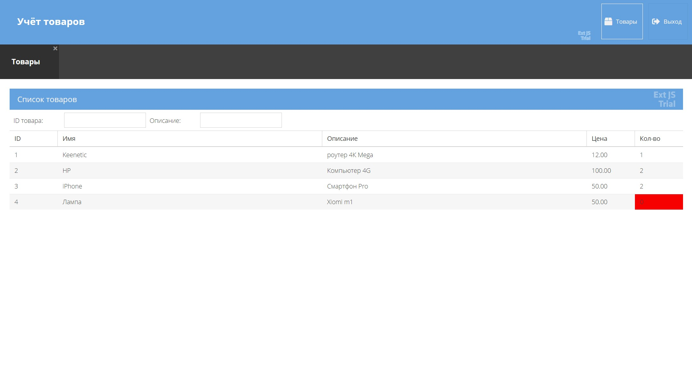

# ProdList-ExtJS

## Описание:

Проект созданный на фреймворке ExtJS.

## Возможности:
- Страница авторизации: логин admin, пароль padmin. При неверном вводе данных появляется сообщение об ошибке.
- Главная страница с информацией о товарах. В header имеется два кнопки "Товары" и "Выход".
- Кнопка "Товары" открывает список товаров. Кнопка "Выход" возвращает на страницу авторизации.
- Вкладка "Список товаров" содержит два фильтра: по ID и описанию товара.
- Таблица товаров состоит из пяти колонок: ID, Название, Описание, Цена и Количество. Если товара нет в наличии, ячейка с количеством выделяется красным цветом.
- При нажатии на название товара появляется модульное окно, где можно изменить цену и количество этого товара.